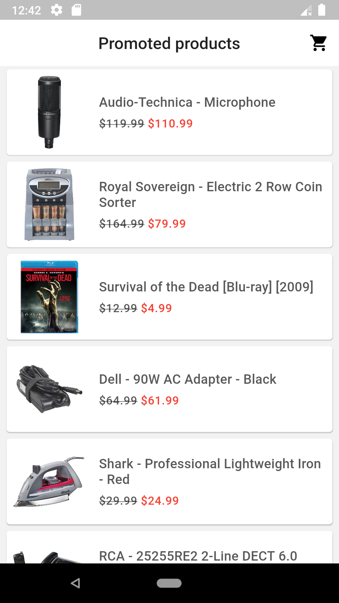
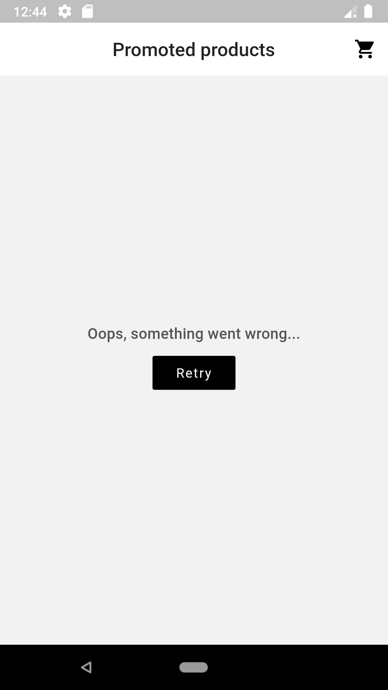
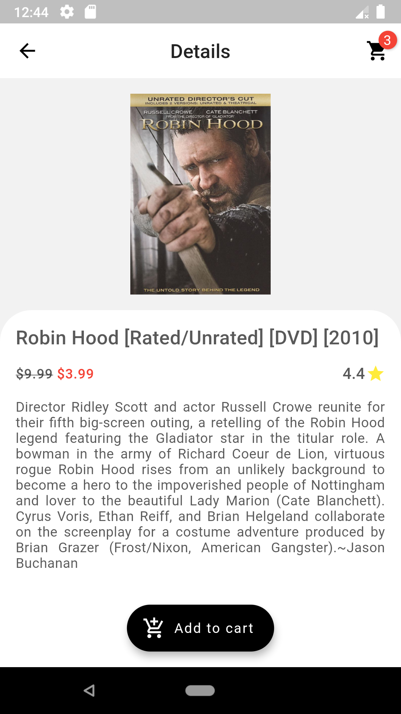
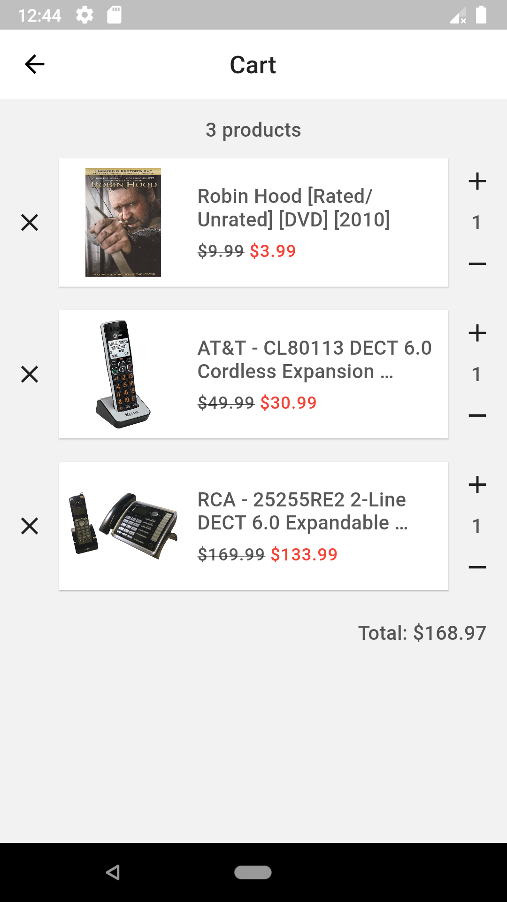
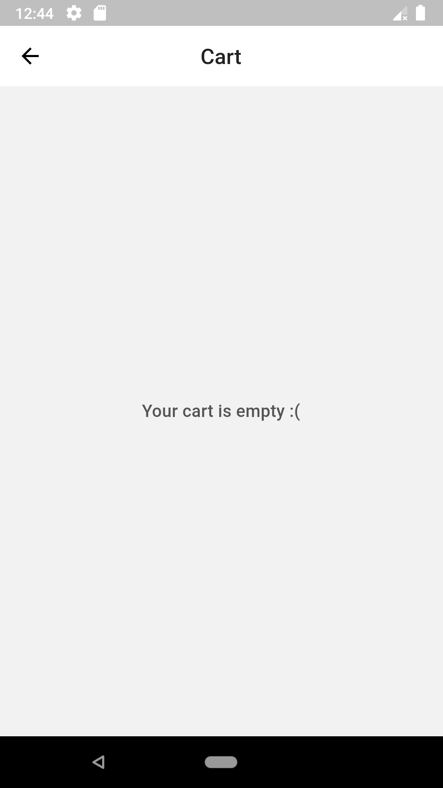

# Flutter Shopping App prototype

An open-source Shopping Application prototype built with Dart and Flutter.

<p float="left">
	
	
	
  
	
</p>

## Overview

### Features

- State management using BLoC;
- Immutable state, models;
- Lazy loading implemented as infinite list;
- Loaded products' caching;
- Material Design UI (not great, not terrible);
- Clean code structure: code is separated to modules by feature, commonly used components, utils, constants are extracted;
- Best Buy API client is implemented as a separate Dart package.
- Unit/widget tests covering pretty much the whole code.

### Dependencies

| Package               | Purpose                                                                                                                    |
| --------------------- | -------------------------------------------------------------------------------------------------------------------------- |
| animations            | Pre-built Material Design transition patterns for smooth page/screen transitions.                                          |
| badges                | Used to show the current items count in the shopping cart.                                                                 |
| built_collection      | Immutable collections to not allow any unexpected state mutations.                                                         |
| cached_network_image  | To load and cache network images.                                                                                          |
| flutter_bloc          | State management solution implementing the BLoC pattern.                                                                   |
| flutter_cache_manager | Generic cache manager for flutter. Used by CachedNetworkImage.                                                             |
| freezed_annotation    | Annotations for the _freezed_ code-generator.                                                                              |
| hydrated_bloc         | An extension to the _flutter_bloc_ library which automatically persists and restores bloc states (used for state caching). |
| path_provider         | To get commonly used locations on host platform file systems.                                                              |
| pedantic              | The Dart analyzer settings and best practices used internally at Google (used for static code analysis).                   |
| rxdart                | Used for asynchronous programming, leveraging the native Dart Streams API (e.g. debouncing multiple events in the stream). |

### DEV Dependencies

| Package           | Purpose                                                                                       |
| ----------------- | --------------------------------------------------------------------------------------------- |
| bloc_test         | Used for BLoC testing.                                                                        |
| build_runner      | A build system for Dart code generation and modular compilation.                              |
| freezed           | Code generation for immutable classes (used to create immutable state class objects, models). |
| json_serializable | Automatically generate code for converting to and from JSON by annotating Dart classes.       |
| mockito           | A mock library to create fake test objects in unit tests.                                     |

## Building

You can follow these instructions to build the app and install it onto your device.

### Prerequisites

If you are new to Flutter, please first follow the [Flutter Setup](https://flutter.dev/setup/) guide.

### Building and installing the Flutter Design Patterns app

```
git clone https://github.com/mkobuolys/shopping-app-prototype.git
cd shopping-app-prototype
flutter run
```

The `flutter run` command both builds and installs the Flutter app to your device or emulator.

### Best Buy API

A real-world API is used in the application to retrieve product data - [Best Buy Products API](https://bestbuyapis.github.io/api-documentation/#products-api).

Before using/testing the application, you need a new API key. Instructions on how to obtain it are provided [here](https://bestbuyapis.github.io/api-documentation/#get-a-key).

Once the key is generated, there are two ways on how to use it within the application:

1. Update the `launch.json` file in your `.vscode` configuration directory, e.g:

```
{
  // Use IntelliSense to learn about possible attributes.
  // Hover to view descriptions of existing attributes.
  // For more information, visit: https://go.microsoft.com/fwlink/?linkid=830387
  "version": "0.2.0",
  "configurations": [
    {
      "name": "shopping-app-prototype",
      "request": "launch",
      "type": "dart",
      "args": ["--dart-define", "BEST_BUY_API_KEY=<ENTER YOUR BEST BUY API KEY HERE>"]
    },
    {
      "name": "best_buy_api",
      "cwd": "packages\\best_buy_api",
      "request": "launch",
      "type": "dart"
    }
  ]
}
```

2. Add the API key as a default value for the BEST_BUY_API_KEY environment variable in `packages/best_buy_api/lib/src/best_buy_api_client.dart`, e.g:

```
...
static const _defaultParameters = <String, String>{
  'apiKey': String.fromEnvironment(
    'BEST_BUY_API_KEY',
    defaultValue: '<ENTER YOUR BEST BUY API KEY HERE>',
  ),
  'format': 'json'
};
...
```

**IMPORTANT**: do not forget to remove the API key from code before publishing any changes to the source control system.
